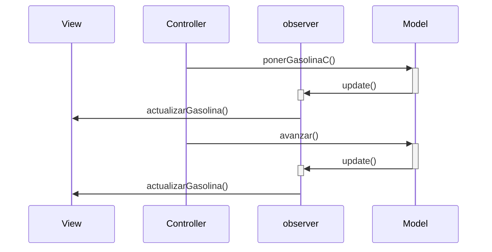
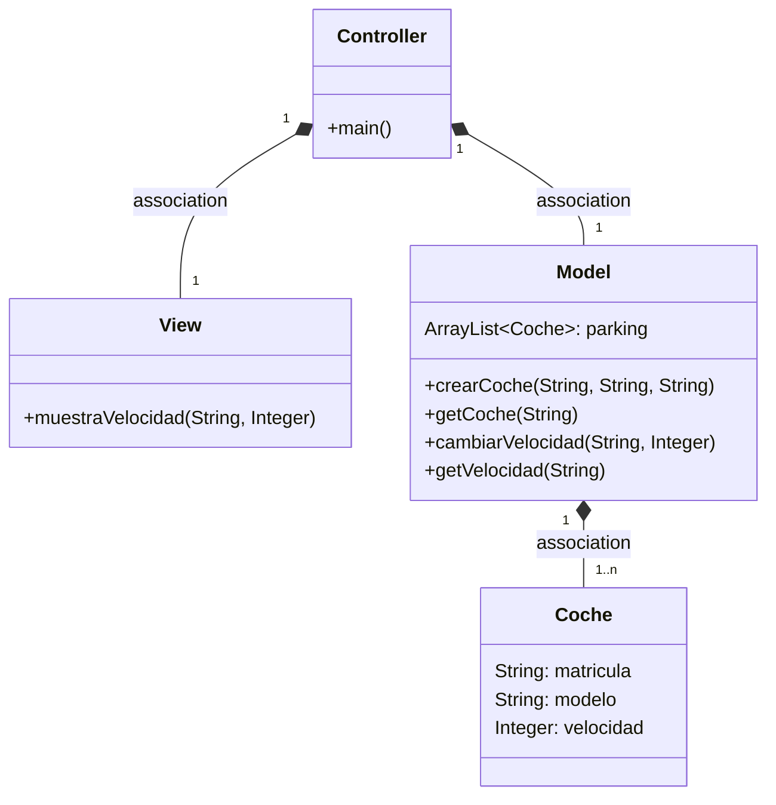
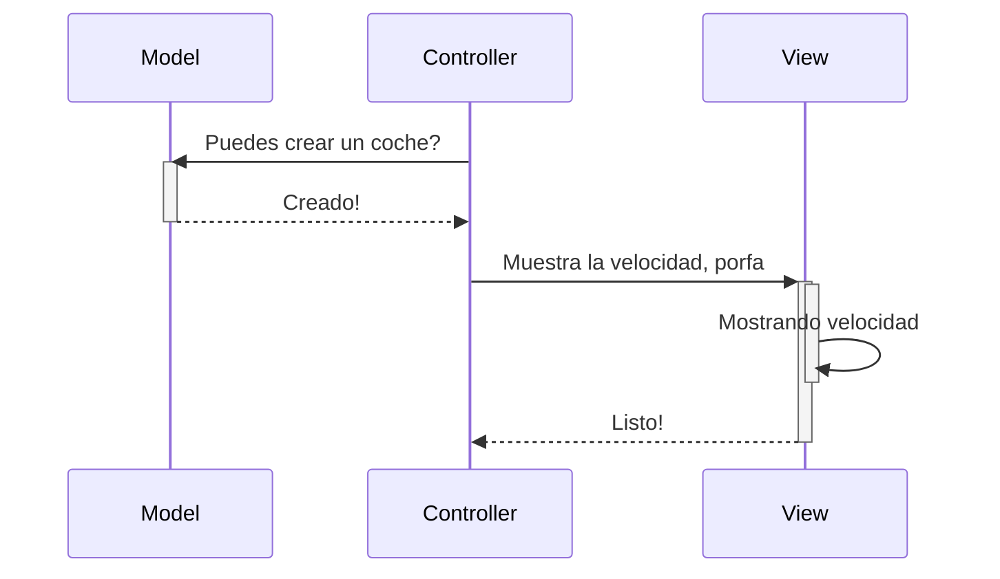
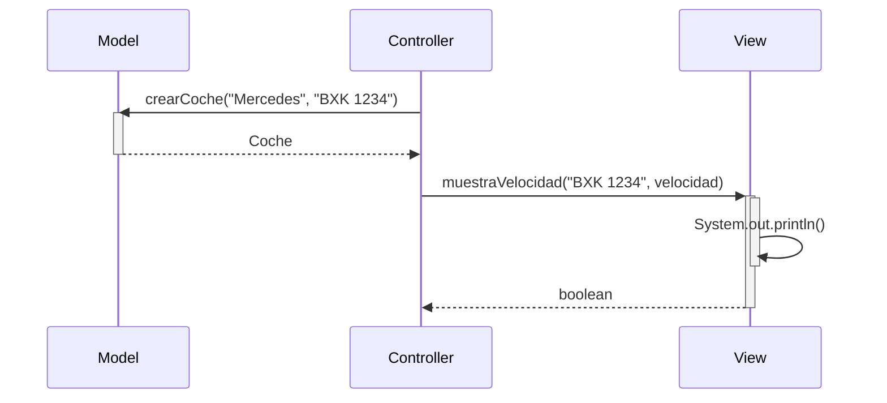

# Examen

1. Hice fue ingresar un valor double llamado ```gasolina``` en el public class coche
2. Le hice un get a gasolina que retorne gasolina(litros)
3. Al toString le agregue en el return la gasolina
4. En el Model cree un public void ```ponerGasolina``` y tambien un ```Avanzar```
5. Hacer un if que muestre el resultando dependiendo de que al cantidad de gasolina es optima y si sobra que muestre el resultado. Si no, que salte el else y muestre un sout diciendo que no tiene suficiente gasolina.


# Examen 2

1. Primero crear una interfaz llamada ```observer``` donde crearemos un void ```actualizarGasolina``` que hara notificar al obsservador de cuanta gasolina queda en el deposito
2. Creamos una lista de observadores que quieren ser notificados cuando cambie la gasolina que seria con un ArrayList y tambien añadimos la capacidad MAXIMA del deposito
3. Seguidamente creamos un nuevo metodo para registrar un nuevo observador (por ejemplo una alarma) y luego otro para notificar a todos los observadores un mensaje cuando se actualice la gasolina
4. De ultimo en el View creamos un ```mostrarMensaje``` y en este codigo se ve el del observer:

```
@Override
public void actualizarGasolina(String mensaje) {
   System.out.println("Alerta de Gasolina: " + mensaje);
   //Este método se llama cada vez que cambia el nivel de gasolina.
   //El mensaje recibido tendrá el formato: "Nivel de gasolina: 8"

   //Separamos el texto usando ":" como separador
   String[] partesDelMensaje = mensaje.split(":");

   //Tomamos la segunda parte (el número), quitamos espacios y lo convertimos a entero
   String textoDelNivel = partesDelMensaje[1].trim();
   int nivelDeGasolina = Integer.parseInt(textoDelNivel);

   //Si el nivel es menor que 10, mostramos una advertencia
   if (nivelDeGasolina < 10) {
       System.out.println("[Alerta] Quedan " + nivelDeGasolina + " litros de gasolina. Recomendado repostar pronto.");
   }
}
```

# Capturas

Captura donde se muestra que el coche al azanzar pierde gasolina y al bajar de 10litros salta la alerta el aviso.


Captura donde se muestra que despues de repostar ya no salta el aviso de que queda poca gasolina


# MVC


---------------------------------------------


# Arquitectura MVC

Aplicación que trabaja con objetos coches, modifica la velocidad y la muestra

---
## Diagrama de clases:



---

## Diagrama de Secuencia

Ejemplo básico del procedimiento, sin utilizar los nombres de los métodos




El mismo diagrama con los nombres de los métodos


## Funciones del Proyecto
# Modelo

```crearVehiculo(String tipo, String placa)```
Genera un nuevo vehículo con el tipo y la placa especificados, y lo incorpora al estacionamiento.

```obtenerVehiculo(String placa)```
Retorna el vehículo asociado a la placa ingresada. Si no se encuentra, se lanza una excepción.

```modificarVelocidad(String placa, Integer velocidadNueva)```
Actualiza la velocidad del vehículo identificado por la placa. Si no existe, se genera una excepción.

```consultarVelocidad(String placa)```
Muestra la velocidad actual del vehículo correspondiente a la placa dada.

```listarVehiculos()```
Devuelve una colección con todos los vehículos almacenados en el estacionamiento.

## Vista
```mostrarVelocidad(String placa, Integer velocidad)```
Presenta en la consola la velocidad actual de un vehículo en el formato: placa: velocidad km/h.

```desplegarTodosLosVehiculos(ArrayList<Vehiculo> vehiculos)```
Muestra en consola un listado de todos los vehículos registrados. Si no hay datos, se informa que no existen registros disponibles.

```menuInteractivo()```
Despliega un menú en la consola que permite al usuario ejecutar las siguientes opciones:

1. Registrar un nuevo vehículo.

2. Incrementar o reducir la velocidad de un vehículo.

3. Visualizar todos los vehículos registrados.

4. Terminar la aplicación.

## Controlador
```incrementarVelocidad(String placa, Integer velocidadNueva)```
Aumenta la velocidad del vehículo identificado por su placa.

```reducirVelocidad(String placa, Integer velocidadNueva)```
Disminuye la velocidad del vehículo correspondiente a la placa dada.

## App

En el fichero ```src/App.java```, el fragmento de código que has desarrollado para que la aplicación funcione es el siguiente:

```
public class App {
public static void main(String[] args) {
Model modelo = new Model();
Controller controlador = new Controller();
        View vista = new View();
        vista.menu();
    }
}
```
Este bloque de código pone en marcha las instancias de las clases ```Model```, ```Controller``` y ```View```, y posteriormente invoca el método ```menu()``` de la clase View para comenzar la interacción con el usuario.

